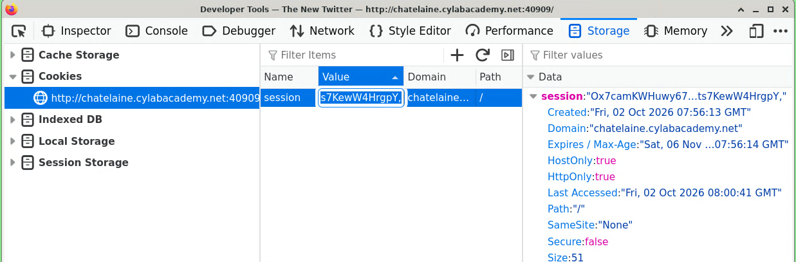
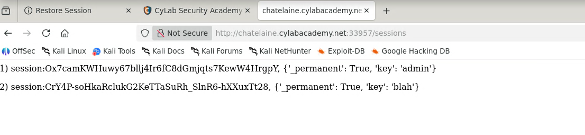
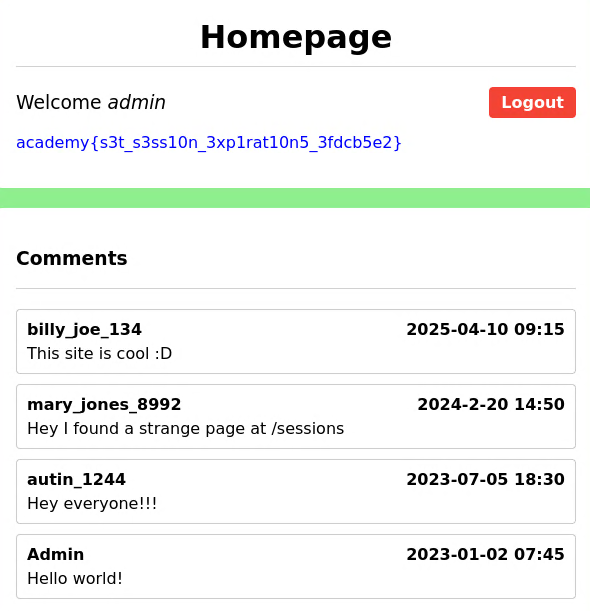
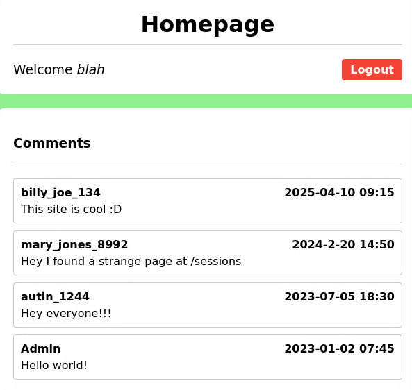

# Client-Side Information Leaks

## Vulnerability: Session Enumeration via Exposed `/sessions` Endpoint

## Concept
Many web apps store session state server-side (in memory, Redis, a file store,
etc.) and only give the client an opaque session ID via a cookie. The server
is supposed to treat that ID as a secret bearer token: whoever presents it is
authenticated as the user it belongs to, with no further verification.

This design breaks down the moment **any information about the session store
itself is leaked** to the client side — a debug route, a verbose error page,
an exposed admin panel, even something accidentally printed to a public page.
If an attacker can read *any* valid session ID (not just their own), they can
simply swap their cookie for it and be instantly authenticated as that
session's owner, including privileged accounts like `admin`. No password,
no XSS, no active attack on another user's browser required — just reading
data the server should never have exposed in the first place.

This class of bug is a **client-side information leak**: sensitive
server-side state (session IDs, usernames, internal routes) ends up visible
to, or discoverable by, the client, and the app's trust model collapses
because it assumed that information would stay private.

## Challenge: picoCTF / CyLab — "Old Sessions" (Easy)

### How this challenge demonstrates the concept
- The app has a public comment feed. One comment, from `mary_jones_8992`,
  hints: *"Hey I found a strange page at /sessions"* — pointing to a hidden
  debug endpoint.
- Visiting `/sessions` dumps the **entire session store** in plaintext:
  session ID → `{'_permanent': True, 'key': <username>}`. One entry has
  `key: 'admin'`.
- A separate comment from user `Admin` ("Hello world!") confirms `admin` is
  a real, active account — not a decoy.
- Overwriting your own `session` cookie with the leaked admin session ID
  authenticates you as `admin` on reload, with no credentials involved.

### Proof of Concept

| Step | Evidence |
|---|---|
| 1. Starting session cookie (`key: blah`) |  |
| 2. `/sessions` leaks all session IDs + owners |  |
| 3. Cookie swapped to admin's session ID → authenticated as admin |  |
| *(for comparison)* same app under the other leaked session |  |

**Flag:** `academy{REDACTED}` — found on the authenticated admin homepage
after the cookie swap.

### Root Cause
- Debug endpoint (`/sessions`) left reachable with no auth or network restriction.
- Session IDs are the *sole* proof of identity — no binding to IP/user-agent,
  no signing, nothing that invalidates a copied ID outside its original context.
- Session metadata (usernames) is stored/exposed in a readable format instead
  of being opaque.

### Impact
Full account takeover of any leaked session, including `admin`, via a pure
information-disclosure bug — no exploitation of the victim required.

### Remediation
1. Remove or heavily restrict any debug/diagnostic route that exposes session
   or internal state; never ship these to production.
2. Never expose session store contents (IDs, usernames, metadata) via any
   client-reachable route.
3. Rotate session IDs on privilege changes (e.g. login) and enforce real
   expirations — avoid permanent (`_permanent: True`) sessions.
4. Bind sessions to additional signals (IP, user-agent) or use signed/
   encrypted cookies so a copied raw ID can't be reused out of context.
5. Treat any user-facing content (comments, forums, etc.) as a potential leak
   vector for internal routes — discovering a path should never be enough to
   compromise the system on its own.

### Classification
- **CWE-200** — Exposure of Sensitive Information to an Unauthorized Actor
- **CWE-384** — Session Fixation (related: app accepts attacker-supplied/reused session IDs)
- **OWASP Top 10** — A01:2021 Broken Access Control / A04:2021 Insecure Design
